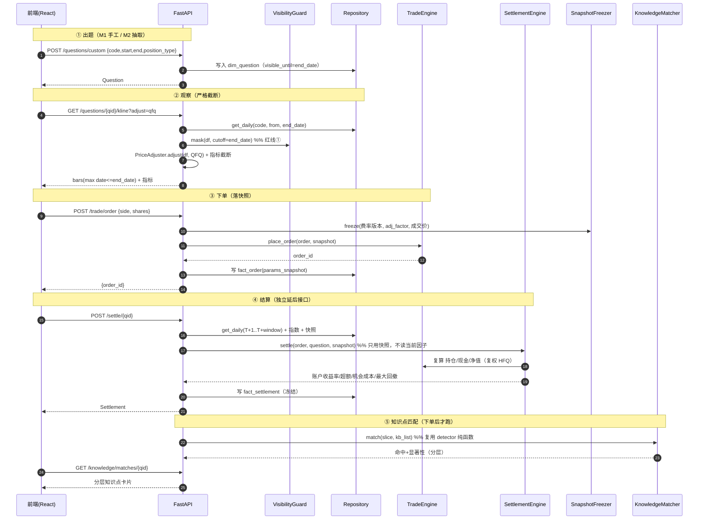
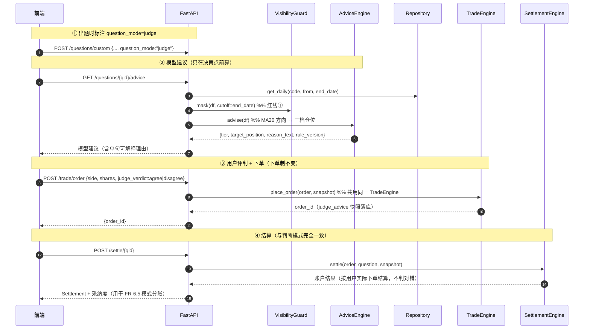
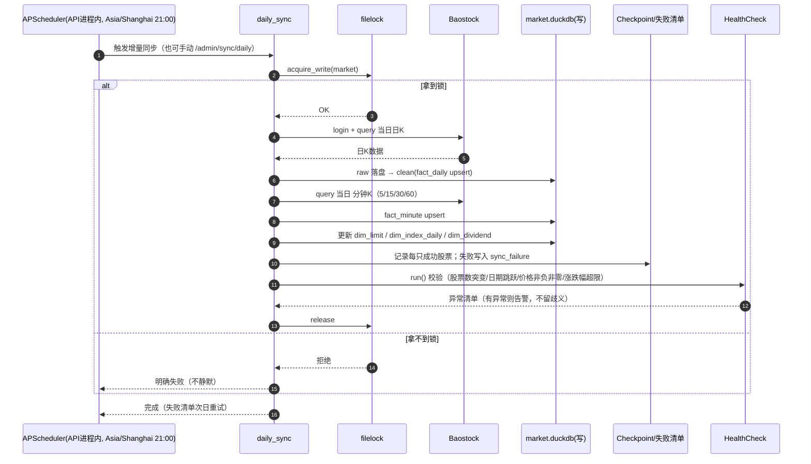
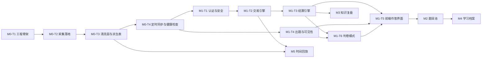

# 复盘 · 技术方案（System Design）

> A 股历史决策训练平台
> 版本：v1.0
> 日期：2026-09-16
> 状态：**设计定稿，待开发**
> 上游文档：`00-设计决策基线.md`、`01-业务需求MRD.md`、`02-知识点库建设计划.md`、`03-时间回放模式设计.md`、`04-需求评审记录.md`、`05-产品文档.md`

---

## 文档说明

- 本文是**实现侧唯一真相来源**，把需求文档（做什么/为什么）翻译成**工程方案**（怎么落地）。
- **冲突裁决**：机制参数以 `00` 为准，需求范围与优先级以 `01` 为准，知识点以 `02` 为准，回放模式以 `03` 为准。本文若与专项文档冲突，**以专项文档为准**并修正本文。
- **本文不写业务规则本身**（费率、T+1 等一律引用 `00`/`03`），只写**结构、接口、流程、文件、任务**。
- 技术约束（不可推翻）：**Python + FastAPI / React + ECharts / DuckDB + Parquet / Baostock 主数据源 / `~/workspace/fupan` / Web UI + 认证 / DeepSeek 走 LLMProvider / 规则+JSON DSL**。

---

# 第一部分 · 实现方案与技术选型

## 1. 核心技术挑战与对策

| # | 挑战 | 本质 | 本方案的落地点（结构化，不靠"注意"） |
|---|---|---|---|
| C1 | **前视偏差** | 未来数据一旦到达客户端就等于没防 | 后端设 **`VisibilityGuard` 唯一出口**：所有行情 DataFrames 必须过 `mask(dt <= cutoff)` 才能出 API 层；`Repository` 返回的原始数据禁止直接下发。红线①（见 §1.4） |
| C2 | **复权三口径** | 存储只存一套，展示/计算各取所需 | 存储只存**不复权 OHLCV + `adj_factor`**；**`PriceAdjuster` 统一现算**前/后/不复权；判断模式展示 qfq、结算 hfq；回放模式展示+成交 none。红线② |
| C3 | **DuckDB 单写者** | 同步任务与 API 不能同时写同一文件 | **拆两个库**：`market.duckdb`（可重下）与 `app.duckdb`（训练数据，最珍贵）；**增量同步作为 API 进程内 APScheduler 任务**（同进程持单写者连接）；首次全量初始化走独立 CLI（API 未启动时执行）。§1.5 |
| C4 | **结算快照冻结** | 复权因子会随新除权重算 | 下单时把 `params_snapshot`（费率版本 + 复权因子 + 成交价）落 `fact_order`；结算只用快照，**不重新读当前因子**。红线⑤ |
| C5 | **成交可行性** | 真实规则多且按板块区分 | **`TradeRuleEngine` 独立模块**：T+1（`available_shares`）、一字板、停牌顺延、板块涨跌幅、价格四舍五入到分。红线③ |
| C6 | **交易引擎共用** | 两模式不得各写一套 | **唯一 `TradeEngine`**：判断模式**单次调用**、回放模式**循环调用**；两模式都调用它。红线⑥ |
| C7 | **知识点是数据不是代码** | 新增知识点不改代码 | `detect_rule` JSON DSL + **`DSLEvaluator` 只认原语**；`Detector` 基类 + Point/Persistent 两路；**两条路复用同一套 detector 纯函数**（用户按需算 / 全历史预计算） |
| C8 | **分钟级前视** | 当前格收盘价不能用 | 回放成交价取**下一格**：`ReplayEngine.order()` 内部固定用 `bar(N+1)`；`fill` 只接受"下一格"bar |
| C9 | **天级数据下载** | 全市场分钟数据 40~200 小时 | **断点续传**：`checkpoint` 记录每只股票已下载到日期；失败清单落库，次日重试 |
| C10 | **性能** | 推进 ≤300ms / 全股票快照 ≤1s | 分钟数据建 `(code, dt)` 索引；**当前格快照预聚合**为 `fact_minute_snapshot`（按 dt 预聚合一行的全市场） |
| C11 | **判卷建议可解释**（N6） | 建议必须一句话说清 | `engine/advice.py::AdviceEngine`：MA20 方向映射三档仓位，输出 `reason_text`；规则式、**禁止 ML/训练数据** |

## 2. 分层架构

```
┌───────────────────────────────────────────────────────────────────┐
│  前端 React + TS + ECharts        K线 / 分时 / 净值曲线 / 学习档案   │
├───────────────────────────────────────────────────────────────────┤
│  服务层 FastAPI                   路由 · 认证鉴权 · 依赖注入 · 定时任务 │
│                                   ↑ 所有行情出口强制过 VisibilityGuard │
├───────────────────────────────────────────────────────────────────┤
│  计算引擎（自研重点）                                                │
│   ├── engine/     TradeEngine · SettlementEngine · SnapshotFreezer  │  ← 两模式共用
│   ├── knowledge/  DSLEvaluator · Detector(P/P) · Matcher · Scorer   │
│   ├── builder/    Segmenter · Tagger · QuestionBuilder              │
│   └── replay/     ReplayClock · SessionStore · DividendAdjuster      │
├───────────────────────────────────────────────────────────────────┤
│  数据访问层       Repository · VisibilityGuard · PriceAdjuster       │
│                   UniverseProvider(时点标的池)                        │
├───────────────────────────────────────────────────────────────────┤
│  数据存储         market.duckdb（行情/知识点，可重下）                 │
│                  app.duckdb（题目/下单/结算/会话，最珍贵）             │
│                  + Parquet 分区文件                                   │
├───────────────────────────────────────────────────────────────────┤
│  数据采集         Baostock（主）· AkShare（按需补充）                   │
└───────────────────────────────────────────────────────────────────┘
```

**分层纪律**：API 层**只依赖** service/engine/data 的接口；engine 层**不依赖** FastAPI；数据访问**只经 Repository**（DAL 是访问 DuckDB 的唯一入口，保证 C1 出口收敛可审计）。

## 3. 技术选型

| 层 | 选型 | 版本建议 | 理由 |
|---|---|---|---|
| 后端语言 | **Python** | 3.11+ | 数据生态（pandas/pyarrow/duckdb/baostock）无缝；`zoneinfo` 原生时区 |
| 后端框架 | **FastAPI** | 0.11x | 异步够用、Pydantic 校验、自动 OpenAPI、依赖注入贴合鉴权 |
| ASGI | Uvicorn + Gunicorn（生产） | — | 本地 uvicorn，服务器 gunicorn+uvicorn worker |
| 存储引擎 | **DuckDB** | 1.x | 单文件零运维、列存向量化、SQL 兼容、按日期区间扫股票正是其强项 |
| 列存格式 | **Parquet + PyArrow** | — | 压缩率高、可被 DuckDB 直接 `read_parquet` |
| 数据处理 | **pandas + numpy** | — | 特征向量化（**禁止逐行 Python**） |
| 数据源 | **baostock**（主）、**akshare**（补） | — | 免费含退市股 / 接口丰富但易失效 |
| 调度 | **APScheduler** | 3.x | **进程内**调度，规避 DuckDB 跨进程写冲突 |
| 进程锁 | **filelock** | 3.x | 写者互斥的兜底保险 |
| 认证 | **passlib[argon2]** + itsdangerous 签名 Cookie | — | 慢哈希 + 有状态会话表 |
| 限速 | **slowapi** | — | 登录失败限速 + 临时锁定 |
| LLM | **openai SDK**（兼容 DeepSeek endpoint） | — | 走 `LLMProvider` 抽象，可换供应商 |
| 前端框架 | **React + TypeScript** | 18 | 生态成熟 |
| 构建 | **Vite** | 5 | 快、TS 开箱即用 |
| 图表 | **ECharts**（`echarts-for-react`） | 5 | K 线/分时/净值曲线能力成熟 |
| UI 组件 | **MUI** + **Tailwind CSS** | 5 / 3 | MUI 给表单/表格/对话框，Tailwind 给布局与定制 |
| 状态 | **Zustand** + **TanStack Query** | — | 轻量全局态 + 服务端态缓存 |
| 路由 | **react-router-dom** | 6 | — |
| 时间 | **dayjs** | — | 与后端北京时间对齐 |

**明确不引入**：PostgreSQL / ClickHouse（运维过重）、Backtrader / vnpy（自研轻量结算更可控）、深度学习框架。

## 4. 六条红线 → 结构落点映射（验收用）

| 红线 | 结构性落点 | 验收断言 |
|---|---|---|
| ① 前视偏差 | `data/visibility.py::VisibilityGuard.mask()` 是所有 `Repository` 结果的**必经装饰器**；API 层禁止直接返回裸 DataFrame | 抓包：任何行情接口 `max(dt) <= cutoff`；单测 `test_visibility.py` |
| ② 复权三口径 | `data/adjuster.py::PriceAdjuster` 唯一算法源；`AdjustMode = QFQ\|HFQ\|NONE`；存储恒为 `NONE + adj_factor` | 单测 `test_adjuster.py`：同一股票 qfq/hfq/none 结果可互推 |
| ③ 成交可行性 | `engine/rules.py::TradeRuleEngine`；`engine/trade_engine.py::TradeEngine.fill()` 内部强制调用规则 | 单测：真实一字板日期买入被拒并顺延 |
| ④ 结算快照冻结 | `engine/snapshot.py::SnapshotFreezer` + `fact_order.params_snapshot`；`SettlementEngine` 只读快照 | 单测：更新 adj_factor 后重算，数字 bit 级一致 |
| ⑤ 交易引擎共用 | `engine/trade_engine.py::TradeEngine` 是**唯一**成交实现；判断模式与回放模式都依赖它 | 代码扫描：不存在第二处成交价计算 |
| ⑥ 幸存者偏差 | `data/universe.py::UniverseProvider.as_of(date)` 基于 `dim_stock.list_date/delist_date` | 单测：指定历史日，标的池不含未上市/已退市股 |

## 5. 存储与并发方案（DuckDB 单写者约束的工程解）

**问题**：DuckDB 同一文件「一写者 或 多读者」，不能「跨进程读写并存」。而本项目：
- **行情数据**写了要能被 API 读；
- **API 自己**也要写训练数据（下单/会话）；
- **同步任务**又要写行情。

**方案：按"可重下 / 不可重下"拆库 + 把同步放进 API 进程**

| 库文件 | 内容 | 写入者 | 读取者 | 备份级别 |
|---|---|---|---|---|
| `data/market.duckdb` | clean 层：`dim_*`、`fact_daily`、`fact_minute`、`fact_knowledge_match` | 同步/批处理任务 | API（只读居多） | **P2**（可重下） |
| `data/app.duckdb` | app 层：`dim_question`、`fact_order`、`fact_settlement`、`sim_*`、`app_user`、`app_settings` | **仅 API 进程** | API | **P0**（不可再生） |

**规则**：
1. **API 进程是 `app.duckdb` 的唯一写者**，与"训练数据只能 API 写"天然一致。
2. **每日增量同步（21:00）作为 API 进程内的 APScheduler 任务运行**——同进程内 DuckDB 允许「1 个读写连接 + 多个只读连接」，因此同步写 `market.duckdb` 时，API 的业务读查询仍可用只读连接并发执行。
3. **首次全量初始化 / 全历史知识点预计算**（天级任务）走**独立 CLI**：约定在 API 未启动时执行；若必须并发，则 API 以 `FUPAN_MARKET_READONLY=1` 启动，`market.duckdb` 只开只读。
4. **兜底**：`core/db.py::DuckDBManager` 用 `filelock` 对 `market.duckdb.write.lock` 加**建议性写锁**，任一写者拿不到锁即明确报错（不留"以为成功了"的歧义，对齐 FR-7.5）。
5. **数据目录**：`~/workspace/fupan`，纳入 git；**`.gitignore` 忽略 `*.duckdb`/`*.parquet` 大文件**，仅提交 DDL、脚本与小型配置。

---

# 第二部分 · 文件列表（完整目录树）

> 约定：仓库根 = `fupan/`（即 `~/workspace/fupan`）。

```
fupan/
├── README.md                          # 项目说明、启动方式、红线说明
├── pyproject.toml                     # Python 依赖 + ruff/mypy/pytest 配置（后端依赖声明唯一来源）
├── .env.example                       # 环境变量样例（数据目录/密钥/LLM key/时区）
├── .gitignore                         # 忽略 *.duckdb/*.parquet/venv/node_modules/.env
├── Makefile                           # 常用命令封装：init/sync/run/test/build/format
├── docker-compose.yml                 # 云服务器一键起服务（nginx + api）
│
├── backend/
│   ├── app/
│   │   ├── __init__.py
│   │   ├── main.py                    # FastAPI 入口：中间件、路由挂载、APScheduler 启动、异常处理注册
│   │   ├── config.py                  # pydantic-settings 配置 + TZ=Asia/Shanghai 常量 + 参数默认值（费率版本号）
│   │   │
│   │   ├── api/                        # ── HTTP 接口层（只做参数校验 + 编排）──
│   │   │   ├── __init__.py
│   │   │   ├── deps.py                # 依赖注入：当前用户、DAL、引擎实例、可见截止点
│   │   │   ├── auth.py                # /auth 登录/登出/会话校验（P0）
│   │   │   ├── question.py            # /questions 抽题/选题/手工出题/K线数据（P0）
│   │   │   ├── trade.py               # /trade 下单 + 账户面板（P0）
│   │   │   ├── settle.py              # /settle 结算（独立延后接口，仅下单后可调，P0）
│   │   │   ├── knowledge.py           # /knowledge 命中结果/速查/全历史统计（M3）
│   │   │   ├── profile.py             # /profile 学习档案（M4）
│   │   │   ├── replay.py              # /replay 会话/advance/快照/下单/净值（M5）
│   │   │   ├── admin.py               # /admin 同步触发/进度/健康检查/参数（P0 健康检查）
│   │   │   └── schemas.py             # 全局 Pydantic 请求/响应模型（DTO 唯一定义处）
│   │   │
│   │   ├── core/                       # ── 基础设施──
│   │   │   ├── __init__.py
│   │   │   ├── db.py                  # DuckDBManager：读写连接、filelock、market/app 双库
│   │   │   ├── security.py            # 密码慢哈希、会话令牌、登录失败限速/锁定
│   │   │   ├── timeutil.py            # 北京时间、交易日历、时间片（advance）工具
│   │   │   ├── errors.py              # 统一错误类型 + 全局异常处理器（→ {code,message}）
│   │   │   └── logging.py             # 结构化日志（同步/结算/匹配可追溯）
│   │   │
│   │   ├── data/                       # ── 数据访问层（访问 DuckDB 的唯一入口）──
│   │   │   ├── __init__.py
│   │   │   ├── models.py              # 数据模型（dataclass）：Stock/Bar/Dividend/Question/Order...
│   │   │   ├── ddl.py                 # 全部建表 DDL（schema 单一真相来源）
│   │   │   ├── repository.py          # 仓储：行情/日历/指数/涨跌停/分红/知识点查询
│   │   │   ├── visibility.py          # VisibilityGuard：mask(dt<=cutoff) —— 红线①唯一出口
│   │   │   ├── adjuster.py            # PriceAdjuster：前/后/不复权现算 —— 红线②
│   │   │   ├── universe.py            # UniverseProvider：时点标的池 —— 红线⑥
│   │   │   └── sync/                  # ── 数据采集与清洗──
│   │   │       ├── __init__.py
│   │   │       ├── baostock_client.py # Baostock 登录/断线重连/查询封装
│   │   │       ├── akshare_client.py  # AkShare 按需补充（1分钟/龙虎榜，绝不做定时任务）
│   │   │       ├── ingest_meta.py     # 股票列表/交易日历/指数/分红 落地
│   │   │       ├── ingest_daily.py    # 日线全量 + 增量
│   │   │       ├── ingest_minute.py   # 分钟线（5/15/30/60）+ 断点续传
│   │   │       ├── precompute_limit.py# 涨跌停价预计算（分板块）
│   │   │       ├── checkpoint.py      # 断点续传状态读写
│   │   │       └── health_check.py    # 数据健康检查（P0）
│   │   │
│   │   ├── engine/                     # ── 交易与结算引擎（两模式共用）──
│   │   │   ├── __init__.py
│   │   │   ├── cost.py                # CostModel：佣金/印花税/过户费/规费/滑点（费率可配）
│   │   │   ├── rules.py               # TradeRuleEngine：T+1/一字板/停牌/板块涨跌幅/顺延 —— 红线③
│   │   │   ├── position.py            # Position/Account 值对象（shares/available_shares/avg_cost/cash）
│   │   │   ├── trade_engine.py        # TradeEngine 核心（下单/成交/持仓/现金/除权/净值）—— 红线⑤
│   │   │   ├── settle.py              # SettlementEngine：账户视角指标（收益率/超额/机会成本/回撤）
│   │   │   ├── advice.py              # AdviceEngine：判卷模式仓位建议（MA20 方向→三档，N6）
│   │   │   └── snapshot.py            # SnapshotFreezer：结算快照冻结 —— 红线④
│   │   │
│   │   ├── knowledge/                  # ── 知识点匹配引擎（M3）──
│   │   │   ├── __init__.py
│   │   │   ├── dsl.py                 # DSL 解析与校验（原语白名单）
│   │   │   ├── features.py            # 特征原语向量化计算（单根K线/序列）
│   │   │   ├── detector.py            # Detector 基类 + PointDetector/PersistentDetector
│   │   │   ├── evaluator.py           # DSLEvaluator：读特征→比较→组合（引擎只认原语）
│   │   │   ├── matcher.py             # KnowledgeMatcher：用户按需算 + 全历史预计算（复用 detector）
│   │   │   ├── scoring.py             # SeverityScorer：显著性打分（confirmation 只用决策点之前）
│   │   │   └── stats.py               # 全历史实证统计（含退市股/标样本量）
│   │   │
│   │   ├── builder/                    # ── 出题（M2）──
│   │   │   ├── __init__.py
│   │   │   ├── segment.py             # 区间切分算法（可复现）
│   │   │   ├── tagging.py             # 区间类型标签（8 类）
│   │   │   ├── generator.py           # 题目生成器（含空仓型/持仓型初始状态）
│   │   │   └── question_id.py         # 可复现题目 ID 哈希
│   │   │
│   │   ├── replay/                     # ── 时间回放（M5）──
│   │   │   ├── __init__.py
│   │   │   ├── clock.py               # ReplayClock：只能 advance(n)，无 set_time(t)
│   │   │   ├── session.py             # SessionStore：sim_* 四表持久化
│   │   │   ├── snapshot.py            # SnapshotService：全市场当前格快照（预聚合）
│   │   │   └── dividend.py            # DividendAdjuster：跨除权日 送股/分红/配股
│   │   │
│   │   └── llm/                        # ── AI 抽象层──
│   │       ├── __init__.py
│   │       ├── provider.py            # LLMProvider 接口（chat(messages, schema)->dict）
│   │       ├── deepseek.py            # DeepSeekProvider（首个实现）
│   │       └── prompts.py             # 脱敏输入构造（编号+时间偏移，无真实日期/股票名）
│   │
│   ├── scripts/                        # ── 运维/批处理入口（CLI）──
│   │   ├── init_data.py               # 首次全量初始化（天级，独立进程）
│   │   ├── daily_sync.py              # 21:00 定时入口（也可被 APScheduler 调用）
│   │   ├── build_question_pool.py     # 批量出题
│   │   └── precompute_matches.py      # 全历史知识点命中预计算（落 fact_knowledge_match）
│   │
│   └── tests/
│       ├── test_visibility.py         # 红线①
│       ├── test_adjuster.py           # 红线②
│       ├── test_rules.py              # 红线③
│       ├── test_trade_engine.py       # 红线⑤ + T+1/涨跌停/停牌
│       ├── test_settle.py             # 红线④ 快照冻结、账户指标
│       ├── test_advice.py             # 判卷模式建议（N6）
│       ├── test_universe.py           # 红线⑥ 时点标的池
│       ├── test_detector.py           # DSL 匹配 + 显著性打分
│       └── test_replay.py             # advance 不可后退、下一格成交、除权
│
├── frontend/
│   ├── package.json                   # Node 依赖声明唯一来源
│   ├── vite.config.ts                 # Vite 配置 + dev proxy → :8000
│   ├── tsconfig.json                  # TS 配置
│   ├── tailwind.config.ts             # Tailwind 配置
│   ├── postcss.config.js              # PostCSS（Tailwind）
│   ├── index.html                     # SPA 入口
│   └── src/
│       ├── main.tsx                   # React 挂载 + QueryClient + Router
│       ├── App.tsx                    # 路由表 + 认证守卫 + 布局
│       ├── api/
│       │   ├── client.ts              # axios 实例（鉴权头、错误拦截）
│       │   └── types.ts               # 后端 DTO 的 TS 镜像类型
│       ├── store/
│       │   ├── auth.ts                # 登录态
│       │   └── question.ts            # 当前题目/账户/下单态
│       ├── pages/
│       │   ├── Login.tsx              # 登录页
│       │   ├── Practice.tsx           # 判断模式作答页（观察→下单）
│       │   ├── Settlement.tsx         # 结算页（账户结果 + 知识点）
│       │   ├── Replay.tsx             # 回放模式页
│       │   ├── Profile.tsx            # 学习档案
│       │   ├── Knowledge.tsx          # 知识库速查
│       │   └── Settings.tsx           # 参数/开关/同步
│       ├── components/
│       │   ├── KLineChart.tsx         # ECharts K线（严格截断于决策点）
│       │   ├── IndicatorOverlay.tsx   # 均线/MACD/KDJ/BOLL 叠加
│       │   ├── PositionPanel.tsx      # 持仓与资金面板
│       │   ├── OrderPanel.tsx         # 下单（股数/金额 + 快捷仓位 + 全仓二次确认）
│       │   ├── AdvicePanel.tsx        # 判卷模式：模型建议 → 用户评判（N6）
│       │   ├── KnowledgeCards.tsx     # 知识点分层卡片
│       │   └── NavChart.tsx           # 净值曲线
│       └── styles/
│           └── index.css              # Tailwind 入口 + 全局样式
│
└── data/                              # 数据目录（大文件 git 忽略）
    ├── market.duckdb                  # 行情/知识点（可重下，P2 备份）
    ├── app.duckdb                     # 训练数据（最珍贵，P0 备份）
    ├── raw/                           # 原始落地层（永不修改）
    ├── clean/                         # Parquet 分区（fact_daily/fact_minute）
    └── app/                           # app 层 Parquet（如需）
```

---

# 第三部分 · 数据结构与接口

## 6. 类图（Mermaid classDiagram）

```mermaid
classDiagram
    direction LR

    %% ── 基础设施 ──
    class DuckDBManager {
        +market_conn
        +app_conn
        +lock : FileLock
        +get_read(layer) Connection
        +get_write(layer) Connection
        +acquire_write(layer)
    }

    %% ── 数据访问层 ──
    class Repository {
        +get_daily(code, start, end) DataFrame
        +get_minute(code, start, end) DataFrame
        +get_calendar(start, end) DataFrame
        +get_index_daily(index_code, start, end) DataFrame
        +get_limit(code, date) Limit
        +get_dividend(code, start, end) DataFrame
        +get_stock(code) Stock
        +list_stocks() DataFrame
        +get_question(qid) Question
        +get_order(oid) Order
    }
    class VisibilityGuard {
        +cutoff : datetime
        +mask(df) DataFrame
        +mask_by_col(df, col) DataFrame
        +assert_no_future(df)
    }
    class PriceAdjuster {
        +adjust(df, mode) DataFrame
        +factor(code, date) float
    }
    class UniverseProvider {
        +as_of(date) List~Stock~
    }
    class SyncService {
        +ingest_meta()
        +ingest_daily(full)
        +ingest_minute(codes, resume)
        +precompute_limit()
        +sync_daily()
    }
    class Checkpoint {
        +last_date_of(code) date
        +mark(code, date)
        +failed_list() List~str~
    }
    class HealthCheck {
        +run() Report
    }

    %% ── 引擎 ──
    class CostModel {
        +commission_rate
        +stamp_tax_rate
        +transfer_fee_rate
        +slippage_rate
        +calc(side, price, shares) FeeDetail
    }
    class TradeRuleEngine {
        +can_buy(bar) bool
        +can_sell(bar, position) bool
        +is_suspended(bar) bool
        +limit_prices(code, date, prev_close) Limit
        +next_tradable(date, side) date
    }
    class Position {
        +shares : int
        +available_shares : int
        +avg_cost : float
        +market_value(price) float
    }
    class Account {
        +cash : float
        +position : Position
        +total_asset(price) float
    }
    class TradeEngine {
        +place_order(order, bar) Order
        +fill(order, bar, cost, rules) Fill
        +apply_dividend(div, position, account)
        +nav(account, price) float
    }
    class SettlementEngine {
        +settle(order, question, snapshot) Settlement
    }
    class SnapshotFreezer {
        +freeze(order, adj_factor, fee_version) ParamsSnapshot
    }
    class AdviceEngine {
        +rule_version : str
        +advise(df) Advice
    }

    %% ── 知识点 ──
    class FeatureBuilder {
        +build(slice) DataFrame
    }
    class DSLEvaluator {
        +eval(rule, features) bool
    }
    class Detector {
        <<abstract>>
        +detect(ohlcv_slice) List~Occurrence~
    }
    class PointDetector {
        +detect(slice)
    }
    class PersistentDetector {
        +detect(slice)
    }
    class KnowledgeMatcher {
        +match(slice, kb_list) List~Match~
        +precompute_all()
    }
    class SeverityScorer {
        +score(match, ctx) float
    }

    %% ── 出题 ──
    class Segmenter {
        +segment(code) List~Interval~
    }
    class QuestionBuilder {
        +build(interval) Question
        +gen_initial_position(kind, price) InitialPosition
    }

    %% ── 回放 ──
    class ReplayClock {
        +current_dt : datetime
        +advance(n) datetime
    }
    class SessionStore {
        +create(session)
        +load(sid) Session
        +save(session)
    }
    class ReplayEngine {
        +create_session(cfg) Session
        +advance(sid, n) Bars
        +order(sid, side, shares) Fill
        +nav(sid) float
    }
    class DividendAdjuster {
        +on_cross_ex_date(session, code)
    }

    %% ── AI ──
    class LLMProvider {
        <<interface>>
        +chat(messages, schema) dict
    }
    class DeepSeekProvider {
        +chat(messages, schema) dict
    }

    %% ── 数据模型 ──
    class Stock {
        +code : str
        +name : str
        +list_date : date
        +delist_date : date
        +board : str
        +industry : str
        +is_st : bool
    }
    class Question {
        +question_id : str
        +code : str
        +start_date : date
        +end_date : date
        +pattern_tag : str
        +position_type : str
        +initial_position : InitialPosition
        +initial_cash : float
        +settle_params : dict
        +visible_until : date
    }
    class Order {
        +order_id : str
        +question_id : str
        +session_id : str
        +dt : datetime
        +side : str
        +shares : int
        +params_snapshot : dict
    }
    class Settlement {
        +order_id : str
        +account_return : float
        +stock_return : float
        +benchmark_return : float
        +alpha : float
        +opp_cost : float
        +max_dd : float
    }

    %% ── 关系 ──
    Repository --> DuckDBManager : uses
    VisibilityGuard ..> Repository : wraps output
    PriceAdjuster ..> Repository : post-process
    UniverseProvider --> Repository : uses
    SyncService --> Repository : writes via
    SyncService --> Checkpoint : uses
    SyncService --> HealthCheck : runs

    TradeEngine --> CostModel : uses
    TradeEngine --> TradeRuleEngine : uses
    TradeEngine --> Account : mutates
    Account *-- Position
    SettlementEngine --> TradeEngine : reuses
    SettlementEngine --> SnapshotFreezer : uses
    AdviceEngine --> Repository : reads (masked)

    KnowledgeMatcher --> Detector : dispatches
    Detector <|-- PointDetector
    Detector <|-- PersistentDetector
    PointDetector --> DSLEvaluator : uses
    PersistentDetector --> DSLEvaluator : uses
    Detector --> FeatureBuilder : uses
    KnowledgeMatcher --> SeverityScorer : uses

    QuestionBuilder --> Segmenter : uses
    QuestionBuilder ..> Question : creates

    ReplayEngine --> ReplayClock : uses
    ReplayEngine --> TradeEngine : reuses
    ReplayEngine --> SessionStore : persists
    ReplayEngine --> DividendAdjuster : uses

    DeepSeekProvider ..|> LLMProvider : implements
    Order ..> Question : for
    Settlement ..> Order : for
```



## 7. DuckDB 表 DDL 要点

> 完整 DDL 在 `backend/app/data/ddl.py`（单一真相来源）。此处给**关键字段 + 索引 + 分区**要点。
> **存储纪律**：行情表只存**不复权 OHLCV + `adj_factor`**，任何复权口径由 `PriceAdjuster` 现算（红线②）。

### 7.1 market.duckdb（clean 层，可重下）

```sql
-- 证券基础信息：时点标的池的前提（红线⑥）
CREATE TABLE dim_stock (
  code VARCHAR PRIMARY KEY,
  name VARCHAR, list_date DATE, delist_date DATE,
  board VARCHAR,          -- main/gem/star/bse
  industry VARCHAR,       -- FR-2.8 行业筛选
  is_st BOOLEAN,
  updated_at TIMESTAMP
);

CREATE TABLE dim_calendar (date DATE PRIMARY KEY, is_trading_day BOOLEAN);

-- 日线：只存不复权 + 复权因子（红线②）
CREATE TABLE fact_daily (
  code VARCHAR, date DATE,
  open DOUBLE, high DOUBLE, low DOUBLE, close DOUBLE,
  volume BIGINT, amount DOUBLE,
  adj_factor DOUBLE,      -- 复权因子（唯一复权真相）
  is_trade BOOLEAN,       -- 是否可成交（停牌=False）
  PRIMARY KEY (code, date)
);
-- 索引：DuckDB 用 ART。CREATE INDEX idx_daily_code_date ON fact_daily(code, date);

-- 分钟线：advance ≤300ms 的前提（按 (code,dt) 索引）
CREATE TABLE fact_minute (
  code VARCHAR, dt TIMESTAMP,
  open DOUBLE, high DOUBLE, low DOUBLE, close DOUBLE,
  volume BIGINT, amount DOUBLE,
  PRIMARY KEY (code, dt)
);
CREATE INDEX idx_min_code_dt ON fact_minute(code, dt);

-- 全市场当前格快照（≤1s 的预聚合，M5）
CREATE TABLE fact_minute_snapshot (
  dt TIMESTAMP, code VARCHAR,
  close DOUBLE, pct_chg DOUBLE, amount DOUBLE, turnover DOUBLE,
  PRIMARY KEY (dt, code)
);

CREATE TABLE dim_limit (code VARCHAR, date DATE, limit_up DOUBLE, limit_down DOUBLE,
                        PRIMARY KEY (code, date));

CREATE TABLE dim_index_daily (index_code VARCHAR, date DATE, close DOUBLE,
                              PRIMARY KEY (index_code, date));

CREATE TABLE dim_dividend (code VARCHAR, ex_date DATE,
                           cash_per_share DOUBLE, share_ratio DOUBLE,
                           rights_ratio DOUBLE, PRIMARY KEY (code, ex_date));

CREATE TABLE dim_knowledge (
  kb_id VARCHAR PRIMARY KEY, name VARCHAR, alias VARCHAR,
  category VARCHAR, sub_category VARCHAR, definition VARCHAR,
  detect_rule VARCHAR,        -- JSON DSL（可为 null）
  detect_type VARCHAR,        -- point/persistent/null
  window_size INT, min_confirm_bars INT, base_weight DOUBLE,
  signal_direction VARCHAR, position_hint VARCHAR,
  meaning VARCHAR, pitfalls VARCHAR, diagram_ref VARCHAR,
  related VARCHAR, sample_min INT DEFAULT 100,
  version INT, enabled BOOLEAN
);

-- 命中预计算（约 3000 万行）
CREATE TABLE fact_knowledge_match (
  match_id VARCHAR PRIMARY KEY, kb_id VARCHAR, code VARCHAR,
  start_date DATE, end_date DATE,
  confidence DOUBLE, severity_score DOUBLE, detail VARCHAR
);
CREATE INDEX idx_match_code ON fact_knowledge_match(code, start_date);
CREATE INDEX idx_match_kb ON fact_knowledge_match(kb_id);
```

### 7.2 app.duckdb（app 层，最珍贵，P0 备份）

```sql
CREATE TABLE dim_question (
  question_id VARCHAR PRIMARY KEY,   -- 可复现哈希
  code VARCHAR, start_date DATE, end_date DATE, pattern_tag VARCHAR,
  position_type VARCHAR,             -- empty / holding
  position_state_tier VARCHAR,       -- N14 教学档：deep_loss/mid_loss/breakeven/small_gain/mid_gain/big_gain（空仓型为 null）
  initial_position VARCHAR,          -- JSON {shares, avg_cost, cost_date} / null（cost_date=反推用的真实交易日）
  initial_cash DOUBLE, source VARCHAR,
  visible_until DATE, settle_window INT, settle_params VARCHAR,
  decision_points VARCHAR,           -- N13 决策点数组（JSON），M1 只放 1 个元素 = [end_date]，预留多决策点扩展位
  question_mode VARCHAR,             -- normal / judge（判卷模式，M1 新增）
  title VARCHAR, description VARCHAR, key_points VARCHAR,
  difficulty_prior DOUBLE, difficulty_post DOUBLE,
  created_at TIMESTAMP
);

CREATE TABLE fact_order (
  order_id VARCHAR PRIMARY KEY,
  question_id VARCHAR, session_id VARCHAR,
  dt TIMESTAMP, side VARCHAR, shares INT, price DOUBLE,
  params_snapshot VARCHAR,           -- 快照冻结：费率版本+adj_factor+成交价（红线④）
  knowledge_mode VARCHAR, viewed_knowledge BOOLEAN,
  judge_verdict VARCHAR,             -- 判卷模式：agree / disagree / null（用户对模型建议的评判，用于模式分账）
  judge_advice VARCHAR,              -- 判卷模式：模型建议快照 JSON {tier, target_position, rule_version}
  created_at TIMESTAMP
);

CREATE TABLE fact_settlement (
  order_id VARCHAR PRIMARY KEY,
  account_return DOUBLE, stock_return DOUBLE, benchmark_return DOUBLE,
  alpha DOUBLE, opp_cost DOUBLE, max_dd DOUBLE, hold_all_return DOUBLE,
  fee_detail VARCHAR, created_at TIMESTAMP
);

CREATE TABLE sim_session (
  session_id VARCHAR PRIMARY KEY, mode VARCHAR, code VARCHAR,
  start_date DATE, end_date DATE, granularity INT,
  current_dt TIMESTAMP, cash DOUBLE, status VARCHAR, created_at TIMESTAMP
);
CREATE TABLE sim_position (
  session_id VARCHAR, code VARCHAR, shares INT, available_shares INT, avg_cost DOUBLE,
  PRIMARY KEY (session_id, code)
);
CREATE TABLE sim_trade (
  trade_id VARCHAR PRIMARY KEY, session_id VARCHAR, dt TIMESTAMP, code VARCHAR,
  side VARCHAR, price DOUBLE, shares INT, fee_detail VARCHAR, cash_after DOUBLE
);
CREATE TABLE sim_nav (
  session_id VARCHAR, date DATE, total_asset DOUBLE, cash DOUBLE, market_value DOUBLE,
  PRIMARY KEY (session_id, date)
);

CREATE TABLE app_user (username VARCHAR PRIMARY KEY, password_hash VARCHAR,
                       totp_secret VARCHAR, created_at TIMESTAMP);
CREATE TABLE app_session (token VARCHAR PRIMARY KEY, username VARCHAR,
                          expires_at TIMESTAMP, created_at TIMESTAMP);
CREATE TABLE app_settings (key VARCHAR PRIMARY KEY, value VARCHAR, updated_at TIMESTAMP);
CREATE TABLE sync_failure (batch_date DATE, code VARCHAR, reason VARCHAR, PRIMARY KEY (batch_date, code));
CREATE TABLE sync_checkpoint (code VARCHAR PRIMARY KEY, last_date DATE, updated_at TIMESTAMP);
```

## 8. 后端 API 接口定义

> 约定：前缀 `/api`；响应统一 `{code, data, message}`（`code=0` 成功）；未登录一律 `401`；行情类接口**返回前必须过 `VisibilityGuard`**。
> 分页：`?page=&size=`，返回 `{items, total}`。

### 8.1 认证（FR-8，P0）

| 方法 | 路径 | 入参 | 出参 | 说明 |
|---|---|---|---|---|
| POST | `/api/auth/login` | `{username, password}` | `{token, expires_at}` | 失败限速；密码慢哈希校验 |
| POST | `/api/auth/logout` | — | `{}` | 会话立即失效 |
| GET | `/api/auth/me` | — | `{username}` | 会话校验 |

### 8.2 出题与观察（FR-2/FR-3，M1~M2）

| 方法 | 路径 | 入参 | 出参 | 说明 |
|---|---|---|---|---|
| GET | `/api/questions/next` | `?pattern_tag=&industry=&board=&position_type=&question_mode=&seed=` | `Question` | 抽题（M2）；M1 用 `custom` |
| POST | `/api/questions/custom` | `{code, start_date, end_date, position_type, position_state_tier?, initial_position?, initial_cash?, settle_window?, question_mode?}` | `Question` | **M1 手工指定一道题**（P0）；`question_mode=judge` 即判卷模式 |
| GET | `/api/questions/{qid}` | — | `Question` | 题目详情（含 `question_mode` / `decision_points`） |
| GET | `/api/questions/{qid}/advice` | — | `{tier, target_position, reason_text, rule_version}` | **判卷模式（N6）**：模型仓位建议。只用决策点前数据，MA20 方向映射三档，`reason_text` 为单句可解释说明 |
| GET | `/api/questions/{qid}/kline` | `?adjust=qfq&indicators=ma,macd,kdj,boll&from=&to=` | `{bars:[{date,open,high,low,close,volume}], indicators:{...}, visible_until}` | **`max(date)<=end_date`**（红线①）；指标严格截断（FR-3.7） |
| GET | `/api/stocks` | `?as_of=YYYY-MM-DD&industry=&board=` | `[{code,name,board,industry}]` | 时点标的池（红线⑥） |

### 8.3 下单 / 结算 / 匹配（FR-4，M1）

| 方法 | 路径 | 入参 | 出参 | 说明 |
|---|---|---|---|---|
| POST | `/api/trade/order` | `{question_id, side:buy\|sell, shares, judge_verdict?}` | `{order_id, est_cost}` | 落 `fact_order` + `params_snapshot`；判卷模式下 `judge_verdict=agree/disagree` |
| GET | `/api/trade/account/{qid}` | — | `{cash, position, position_ratio}` | 持仓与资金面板（FR-3.3） |
| POST | `/api/settle/{qid}` | — | `Settlement` | **独立延后**：仅下单后可调（FR-4.7，防抓包） |
| GET | `/api/knowledge/matches/{qid}` | — | `[{kb_id,name,category,count,occurrences:[{start,end,score}], stats}]` | **仅下单后可调**（M3） |

### 8.4 知识库速查 / 统计（FR-5，M3）

| 方法 | 路径 | 入参 | 出参 |
|---|---|---|---|
| GET | `/api/knowledge` | `?category=&q=&page=&size=` | 知识点列表 |
| GET | `/api/knowledge/{kb_id}` | — | 知识点详情 + 全历史实证统计（含样本量） |

### 8.5 学习档案（FR-6，M4）

| 方法 | 路径 | 入参 | 出参 |
|---|---|---|---|
| GET | `/api/profile/summary` | — | 累计有效练习数等 |
| GET | `/api/profile/positions` | — | 平均仓位/方向匹配度/持仓型选择分布 |
| GET | `/api/profile/practices` | `?page=&size=` | 练习记录（含机会成本+超额配对） |

### 8.6 时间回放（FR-9/FR-10，M5）

| 方法 | 路径 | 入参 | 出参 | 说明 |
|---|---|---|---|---|
| POST | `/api/replay/sessions` | `{mode:single\|multi, code?, start_date, end_date?, granularity, initial_cash}` | `Session` | 建会话 |
| GET | `/api/replay/sessions/{sid}` | — | `Session` | 恢复会话（FR-10.1） |
| POST | `/api/replay/sessions/{sid}/advance` | `{n}` | `{current_dt, bars}` | **只有 advance，无 set_time**（红线/FR-9.4） |
| GET | `/api/replay/sessions/{sid}/kline` | `?indicators=` | `{m1:[...]}` | 仅 `dt<=current_dt` |
| GET | `/api/replay/sessions/{sid}/snapshot` | — | `[{code,close,pct_chg}]` | 全股票快照（预聚合，≤1s） |
| POST | `/api/replay/sessions/{sid}/order` | `{side, shares, code?}` | `Fill` | **成交取下一格**（FR-9.6） |
| GET | `/api/replay/sessions/{sid}/nav` | — | `[{date,total_asset}]` | 净值曲线 |
| POST | `/api/replay/sessions/{sid}/finish` | — | `Report` | 复盘报告（FR-9.16） |

### 8.7 系统设置（FR-7/FR-8.8，M0）

| 方法 | 路径 | 入参 | 出参 |
|---|---|---|---|
| POST | `/api/admin/sync/daily` | — | `{job_id}`（手动触发增量） |
| GET | `/api/admin/sync/status` | — | `{running, progress, failures}` |
| GET | `/api/admin/health` | — | 健康检查报告（P0） |
| GET/PUT | `/api/admin/params` | 参数对象 | 费率/滑点/结算窗口/开关 |

---

# 第四部分 · 程序调用流程（时序图）

## 9. 判断模式「观察 → 下单 → 结算 → 知识点匹配」



### 9.1 判卷模式（判断模式的分支，M1-T6）



> **判卷模式语义（N6 已拍板）**：模型只输出**仓位建议**；用户**评判建议 + 仍自己下单**，结算按**用户实际下单**执行（不引入第二套结算语义，与判断模式共用 `TradeEngine`/`SettlementEngine`）。记录 `judge_verdict` 供模式分账与学习统计，**不产生"对/错"判定**。

## 10. 回放模式「advance → 除权 → 下单 → 下一格成交」

```mermaid
sequenceDiagram
    autonumber
    participant FE as 前端
    participant API as FastAPI
    participant RC as ReplayClock
    participant RE as ReplayEngine
    participant DA as DividendAdjuster
    participant REPO as Repository
    participant TE as TradeEngine
    participant SS as SessionStore

    Note over FE,SS: ① 建会话 / 恢复
    FE->>API: POST /replay/sessions {mode,code,start,granularity,initial_cash}
    API->>SS: create(sim_session); 写 sim_position(initial)
    SS-->>FE: Session

    Note over FE,RE: ② 推进（只能前进）
    FE->>API: POST /replay/sessions/{sid}/advance {n}
    API->>RC: advance(n)   %% 无 set_time(t)
    RC->>REPO: get_minute(code, current_dt, +n格)
    RC->>DA: 检查是否跨除权日
    DA->>TE: apply_dividend(送股→股数, 分红→现金)（红线②/FR-9.12）
    RC->>SS: 更新 current_dt + sim_nav
    RC-->>API: {current_dt, bars(dt<=current_dt)}
    API-->>FE: 推进结果（当日分时只到当前格）

    Note over FE,TE: ③ 下单（成交取下一格）
    FE->>API: POST /replay/sessions/{sid}/order {side,shares}
    API->>RE: order(sid, side, shares)
    RE->>REPO: get_minute(code, next_bar = current_dt+granularity)
    RE->>TE: fill(order, next_bar, cost, rules)  %% 红线③⑤
    TE-->>RE: Fill / 顺延(一字板/停牌)
    RE->>SS: 写 sim_trade + sim_position + sim_nav
    RE-->>API: Fill
    API-->>FE: 持仓/现金/净值更新

    Note over FE,API: ④ 结束
    FE->>API: POST /replay/sessions/{sid}/finish
    API-->>FE: Report（净值曲线/交易统计/对比沪深300）
```

## 11. 每日数据同步（21:00 北京时间，进程内定时）



---

# 第五部分 · 任务列表（分阶段）

> **分解原则**（对齐任务分解硬性约束）：**每个里程碑内任务数 ≤ 5**；每个任务**成组包含 ≥ 3 个相关文件**，按**功能模块/层次**分组而非单文件拆分；**每个里程碑的第一个任务必须是该阶段的基础设施**。
> **例外**：M1 因 team-lead 拍板「判卷模式纳入 M1」，任务数为 **6**（M1-T6 为新增；判卷模式含独立规则引擎 + API + 前端交互，单独成任务优于塞进前端任务）。
> **第一阶段 = M0 + M1**，分解到**可直接开工**（文件级 + 验收点）。**M2~M5 给到模块级**。

## 12. 阶段总览与依赖

| 阶段 | 名称 | 任务数 | 依赖 | 交付焦点 |
|---|---|---|---|---|
| **M0** | 数据底座 | 4 | — | 数据装进库、定时同步、健康检查 |
| **M1** | 单题闭环 | 6 | M0 | 登录 + 交易引擎 + 下单 + 结算 + **判卷模式** |
| **M2** | 题目池与出题 | 4 | M1 | ≥10万题、空仓/持仓型、ID 可复现 |
| **M3** | 知识复盘 | 4 | M1 | 30 知识点、匹配、显著性、展示 |
| **M4** | 学习档案 | 3 | M2 | 仓位分布、机会成本追踪 |
| **M5** | 时间回放 | 4 | M0+M1 | 分钟数据、推进、不复权+除权、净值 |



## 13. M0 · 数据底座（详细）

### M0-T1 · 项目基础设施与工程骨架
- **做什么**：初始化 git 仓库与目录结构；建立 Python 环境、配置体系、数据库连接管理、日志、统一错误处理、FastAPI 空壳与 CLI 入口。
- **产出文件**：
  `pyproject.toml`、`.env.example`、`.gitignore`、`Makefile`、
  `backend/app/main.py`、`backend/app/config.py`、
  `backend/app/core/db.py`、`backend/app/core/logging.py`、`backend/app/core/errors.py`、`backend/app/core/timeutil.py`、
  `backend/app/data/models.py`、`backend/app/data/ddl.py`。
- **依赖**：无（起点）。
- **验收点**：`make run` 起 FastAPI，`/api/health` 返回 200；`DuckDBManager` 能打开 `market.duckdb`/`app.duckdb` 并建出全部空表；`timeutil.now_bj()` 返回北京时间。
- **优先级**：P0。

### M0-T2 · 数据采集与原始落地（Baostock 主 / AkShare 补）
- **做什么**：封装 Baostock（登录/重连/查询）；落地股票列表、交易日历、指数、分红；实现日线全量+增量拉取，原始层永不变；AkShare 仅提供按需接口（不做定时）。**并完成退市整理期数据可得性的一次性探测（NA3 验证任务）**。
- **产出文件**：
  `backend/app/data/sync/baostock_client.py`、`akshare_client.py`、`ingest_meta.py`、`ingest_daily.py`、`backend/scripts/init_data.py`。
- **依赖**：M0-T1。
- **验收点**：
  1. 能拉出**含退市股**的全 A 股日线（覆盖 ≥30 年）；`dim_stock` 含 `list_date/delist_date`；raw 层原样落盘。
  2. **（NA3）退市整理期数据可得性探测**：抽样若干已知退市股（如乐视网、康美药业），验证 Baostock 是否提供**退市整理期**的日线行情（含最后成交价）；产出结论落 `docs/`（一份简短实测记录）。
- **降级方案（若 NA3 验证失败）**：退市整理期数据不可得时，`SettlementEngine` 的"退市股强制平仓"分支降级为——**按退市前最后一个可成交交易日的收盘价平仓**，并在结算页显式标记"数据受限"；保证结算不中断、口径可解释，且**不影响红线④（快照冻结仍生效）**。
- **优先级**：P0。

### M0-T3 · 清洗层与派生表（复权因子 / 涨跌停 / 时点池）
- **做什么**：raw → clean（统一 schema、补日历）；`PriceAdjuster` 前/后/不复权现算；`precompute_limit` 按板块算涨跌停价（四舍五入到分）；`UniverseProvider` 时点标的池；`Repository` 查询封装。
- **产出文件**：
  `backend/app/data/adjuster.py`、`backend/app/data/universe.py`、`backend/app/data/repository.py`、`backend/app/data/sync/precompute_limit.py`。
- **依赖**：M0-T2。
- **验收点**：`test_adjuster.py` 三口径可互推（红线②）；`test_universe.py` 指定历史日不含未上市/已退市股（红线⑥）；任意股票任意日期可查行情+复权价+涨跌停价。
- **优先级**：P0。

### M0-T4 · 定时同步、断点续传与健康检查
- **做什么**：APScheduler 进程内定时（**Asia/Shanghai 21:00**）；`checkpoint` 断点续传 + 失败清单；`health_check` 四项校验并告警；`admin` 接口（手动触发/进度/健康）。
- **产出文件**：
  `backend/app/data/sync/checkpoint.py`、`ingest_minute.py`、`health_check.py`、
  `backend/app/api/admin.py`、`backend/scripts/daily_sync.py`。
- **依赖**：M0-T3。
- **验收点**：定时任务跑通且失败会告警（不留"以为成功"）；健康检查四项全过；分钟拉取可中断续传。
- **优先级**：P0（FR-1.6 / FR-7.1）。

> **M0 完成标志**：能查出任意股票任意日期的行情/复权价/涨跌停价；21:00 定时同步跑通且异常会告警。

## 14. M1 · 单题闭环（详细）

### M1-T1 · 认证、安全与中间件（N3：先密码，TOTP 后置）
- **做什么**：**单账号 + 密码慢哈希 + 登录失败限速/临时锁定 + 会话管理 + 全站 HTTPS + CSRF/CSP + 参数化查询 + 暴露面收敛**；全局鉴权依赖（未登录一律 401）；统一错误响应。`app_user.totp_secret` 字段**保留但不启用**。
- **产出文件**：
  `backend/app/core/security.py`、`backend/app/api/auth.py`、`backend/app/api/deps.py`（鉴权部分）、`backend/app/main.py`（中间件注册）。
- **依赖**：M0-T1。
- **验收点**：未登录访问业务接口 401；密码不落明文；连续失败触发锁定；HTTPS 配置就绪；CSRF/CSP 生效；SQL 全参数化（FR-8.1~8.6）。
- **M1 范围收敛**：**不含 TOTP 双因素**（`app_user.totp_secret` 标注「P1 预留，M1 不启用」，接入点预留在登录流程，但 M1 不实现校验）。
- **优先级**：P0。

### M1-T2 · 交易引擎（两模式共用核心）
- **做什么**：`CostModel`（佣金/印花税/过户费/规费/滑点，费率可配）；`TradeRuleEngine`（T+1/一字板/停牌/板块涨跌幅/顺延到分）；`Position/Account` 值对象；`TradeEngine`（下单/成交/持仓/现金/净值）。
- **产出文件**：
  `backend/app/engine/cost.py`、`rules.py`、`position.py`、`trade_engine.py`、`backend/tests/test_rules.py`、`test_trade_engine.py`。
- **依赖**：M1-T1、M0-T3。
- **验收点**：真实一字板日买入被拒并顺延（红线③）；T+1 当日买入不可卖、卖出后可再买；费用与手算一致；**全仓只有此一处成交实现**（红线⑤）。
- **N13 扩展位（不增加 M1 工作量）**：`TradeEngine` 的调用模型**按"可被多次调用"设计**（`place_order` 无状态、可绑定不同决策点），**不得写死成"一题只能调一次"**；M1 只用单决策点，但接口签名预留 `decision_point` 参数。
- **优先级**：P0。

### M1-T3 · 结算引擎与快照冻结
- **做什么**：`SnapshotFreezer` 冻结费率版本+复权因子+成交价；`SettlementEngine` 用**后复权**算账户视角指标（收益率/标的/基准/超额/机会成本/最大回撤/全程持有对照），**不判对错**。
- **产出文件**：
  `backend/app/engine/snapshot.py`、`settle.py`、`backend/app/api/settle.py`、`backend/tests/test_settle.py`。
- **依赖**：M1-T2。
- **验收点**：更新 `adj_factor` 后重算数字**完全一致**（红线④）；结算页无"对/错/成功/失败"字样；结算接口独立且仅下单后可调。
- **优先级**：P0。

### M1-T4 · 出题（手工）与可见性防火墙
- **做什么**：`VisibilityGuard`（红线①唯一出口）；手工出题 API（**含空仓型/持仓型初始状态**）；K 线数据接口（前复权 + 指标截断于决策点）；时点标的池接口。
- **产出文件**：
  `backend/app/data/visibility.py`、`backend/app/api/question.py`、`backend/app/api/schemas.py`、`backend/tests/test_visibility.py`。
- **依赖**：M0-T3、M1-T1。
- **验收点**：任何行情接口 `max(date) <= end_date`（红线①）；可手工指定持仓型题目；指标末点日期 ≤ 决策点。
- **优先级**：P0（FR-2.6 / FR-3.2）。

### M1-T5 · 前端骨架与作答界面
- **做什么**：Vite+React+TS+Tailwind+MUI 骨架、路由与认证守卫、API client；K 线图（严格截断）、持仓资金面板、下单面板（股数/金额+快捷仓位+**全仓二次确认**）、结算页、**判卷模式交互（模型建议 → 用户评判 → 下单 → 结算）**。
- **产出文件**：
  `frontend/package.json`、`vite.config.ts`、`tsconfig.json`、`tailwind.config.ts`、`index.html`、
  `frontend/src/main.tsx`、`App.tsx`、`api/client.ts`、`api/types.ts`、
  `src/pages/Login.tsx`、`Practice.tsx`、`Settlement.tsx`、
  `src/components/KLineChart.tsx`、`PositionPanel.tsx`、`OrderPanel.tsx`、`AdvicePanel.tsx`。
- **依赖**：M1-T3、M1-T4、M1-T6。
- **验收点**：浏览器登录 → 手工指定一道题（含初始持仓）→ **实际下单** → 看到账户结果；判卷模式能展示「模型建议 → 用户评判 → 结算」全流程；**一键全仓触发二次确认（N15）**；单题全流程 ≤3 秒（FR-非功能）。
- **优先级**：P0。

### M1-T6 · 判卷模式（判断模式分支，N6/NA1）
- **做什么**：`AdviceEngine` 输出**模型仓位建议**（规则式、可解释）；`/questions/{qid}/advice` 接口；下单时记录 `judge_verdict`；结算复用 `TradeEngine`/`SettlementEngine`（**不新增结算语义**）；供 FR-6.5 模式分账。
- **规则策略（N6 拍板：最简、可解释、非 ML）**：
  - 用决策点前数据算 **MA20**（前复权收盘），`advise()` 输出 **3 档仓位**：
    | 条件 | 档位 | 建议目标仓位 |
    |---|---|---|
    | `close > MA20` 且 `MA20 斜率 > 0` | 积极（high） | 70% |
    | `close < MA20` 且 `MA20 斜率 < 0` | 谨慎（low） | 10% |
    | 其余（中性） | 中性（mid） | 40% |
  - `reason_text` 单句示例：「收盘价站上 20 日均线且均线上行 → 建议积极（约 70% 仓位）」。
  - **只用决策点前数据、严格过 `VisibilityGuard`**；规则带 `rule_version`。
- **产出文件**：
  `backend/app/engine/advice.py`、`backend/app/api/question.py`（advice 接口）、`backend/tests/test_advice.py`、`backend/app/data/ddl.py`（`question_mode`/`judge_*` 字段）。
- **依赖**：M1-T3、M1-T4。
- **验收点**：给定决策点能输出档位 + 单句可解释理由；`close/MA20` 输入严格截断于决策点（红线①）；`judge_verdict` 入库；结算与判断模式结果口径一致。
- **优先级**：P1（M1 内交付）。

> **M1 完成标志**：能从浏览器登录、手工指定一道题（含初始持仓）并完成下单，算出账户结果；**判卷模式可展示"模型建议 → 用户评判 → 结算"**。

## 15. M2 · 题目池与出题（模块级）

| 任务 | 做什么 | 主要产出文件 | 依赖 | 优先级 |
|---|---|---|---|---|
| **M2-T1** 区间切分与标签 | `Segmenter` 可复现切区间；8 类区间标签 | `builder/segment.py`、`tagging.py` | M1 | P1 |
| **M2-T2** 题目生成与初始状态 | `QuestionBuilder`；空仓/持仓型初始状态生成；**N14 六档教学状态构造**（见 §15.1）；可复现 ID 哈希 | `builder/generator.py`、`question_id.py` | M2-T1 | P1 |
| **M2-T3** 难度量化 | 事前/事后难度（均不展示） | `builder/generator.py`（难度段）、`api/question.py`（抽题/筛选） | M2-T2 | P2 |
| **M2-T4** AI 挑选与叙述 | `LLMProvider` 抽象 + DeepSeek；脱敏输入；结构化输出校验 | `llm/provider.py`、`deepseek.py`、`prompts.py` | M2-T2 | P1 |

> 完成标志：题目池 ≥10 万道，空仓型与持仓型均有，ID 可复现。`question_id` 由 股票+区间+**初始持仓**+参数 哈希生成。

### 15.1 N14 持仓型初始状态构造方案（拍板：**刻意构造教学状态**）

**目标**：让持仓型题目覆盖"该不该卖 / 加仓 / 减仓"的**关键心理位置**，而非随机成本。

**六档教学状态**（`position_state_tier`）：

| 档位 | 目标浮盈亏 | 训练什么能力 | `avg_cost` 反推 |
|---|---|---|---|
| `deep_loss` | ≈ −20% | **止损纪律**：深度套牢时是否割肉 | `P_T / 0.80` |
| `mid_loss` | ≈ −8% | **扛单 vs 止损**：中度浮亏的决断 | `P_T / 0.92` |
| `breakeven` | ≈ 0（−2%~+2%） | **保本心理**：平手时最易犹豫 | 最接近 `P_T` 的真实收盘价 |
| `small_gain` | ≈ +8% | **小赚就跑 vs 让利润奔跑** | `P_T / 1.08` |
| `mid_gain` | ≈ +15% | **止盈 vs 持有** | `P_T / 1.15` |
| `big_gain` | ≈ +40% | **兑现 vs 加仓** | `P_T / 1.40` |

**成本价必须由区间内真实价格反推（关键约束）**：

1. 取决策点 T 的**前复权收盘价** `P_T`（与展示口径一致）。
2. 按目标比例算参考成本 `cost_ref = P_T / (1 + r)`。
3. 在区间 `[start_date, end_date]` 的**真实收盘价序列**中，取**最接近 `cost_ref` 的那一天的收盘价**作为 `avg_cost`，并把该日记为 `cost_date`。
4. 于是**构造出的实际浮盈亏 = (P_T − avg_cost) / avg_cost**，与目标档位可能略有偏差（取决于区间内是否存在贴近 `cost_ref` 的真实价），**但成本一定是真实历史价**，绝不凭空造数。
5. 若区间内所有真实价都远离 `cost_ref`（例如单调下跌区间里凑不出 +40%），则**该档位在此区间不生成**（宁可不出，不造数）——保证"浮亏比例与真实行情一致"。

**持仓规模**：默认初始总资产 = 10 万（与空仓型一致）；持仓市值占比默认 50%，即 `shares = floor(0.5 × 100000 / avg_cost / 100) × 100`（整手），`initial_cash = 100000 − shares × avg_cost`。仓位占比可配。

**落库**：`dim_question.position_state_tier`、`initial_position = {shares, avg_cost, cost_date}`。

**影响**：`QuestionBuilder.gen_initial_position(kind, tier, interval)` 与 `dim_question.initial_position`（见 §7.2 DDL）。

> **N14 遗留**：档位默认配比（是否六档等权、是否要偏向浮亏档）未定，建议 M2 出题后按"每档样本量均衡"自动配比，不写死。

## 16. M3 · 知识复盘（模块级）

| 任务 | 做什么 | 主要产出文件 | 依赖 | 优先级 |
|---|---|---|---|---|
| **M3-T1** DSL 与特征引擎 | DSL 解析/校验、特征原语向量化 | `knowledge/dsl.py`、`features.py`、`evaluator.py` | M1 | P1 |
| **M3-T2** 检测器两路 | `Detector` 基类 + Point/Persistent；**两路复用同一纯函数** | `knowledge/detector.py` | M3-T1 | P1 |
| **M3-T3** 匹配与显著性 | 用户按需算 + 全历史预计算；`confirmation` 只用决策点之前 | `knowledge/matcher.py`、`scoring.py`、`scripts/precompute_matches.py` | M3-T2 | P1 |
| **M3-T4** 知识点库与展示 | 批次 1 的 30 种入库 + 双关卡验收；速查/统计 API + 前端卡片与高亮 | `data/`（dim_knowledge 数据）、`api/knowledge.py`、`frontend/src/components/KnowledgeCards.tsx`、`pages/Knowledge.tsx` | M3-T3 | P1 |

> 完成标志：下单后自动匹配、分层展示（默认展开前 40%）并高亮 K 线位置；样本 <100 标"数据不足"。

## 17. M4 · 学习档案（模块级）

| 任务 | 做什么 | 主要产出文件 | 依赖 | 优先级 |
|---|---|---|---|---|
| **M4-T1** 练习记录与统计 | 有效练习计数（重复只计首次）、分区间类型统计 | `api/profile.py`、`data/repository.py`（统计查询） | M2-T2 | P1 |
| **M4-T2** 仓位分布与机会成本 | 平均仓位/方向匹配度/持仓型选择分布；机会成本与超额**配对** | `api/profile.py`、`frontend/src/pages/Profile.tsx` | M4-T1 | P0/P1 |
| **M4-T3** 知识学习效果 | 复盘查看率、看过某知识点后表现变化 | `api/profile.py`、`knowledge/stats.py` | M4-T1、M3 | P2 |

> 完成标志：能按区间类型看到自己的仓位分布与账户收益；**不出现形容词**，只给数字与对照。

## 18. M5 · 时间回放（模块级）

| 任务 | 做什么 | 主要产出文件 | 依赖 | 优先级 |
|---|---|---|---|---|
| **M5-T1** 分钟数据接入（含断点续传） | 5/15/30/60 分钟线；单股票按需 / 全股票预下载（2~8 天） | `data/sync/ingest_minute.py`、`checkpoint.py`（复用 M0-T4） | M0 | P1 |
| **M5-T2** 推进与会话持久化 | `ReplayClock`（只 advance）、`SessionStore`（sim_* 四表）、`ReplayEngine` | `replay/clock.py`、`session.py`、`ReplayEngine`、`api/replay.py` | M1-T2 | P1 |
| **M5-T3** 不复权 + 除权处理 | 展示/成交一律不复权；跨除权日 送股/分红/配股（红利税 MVP=0 标注） | `replay/dividend.py`、`replay/snapshot.py`、`tests/test_replay.py` | M5-T2 | P1 |
| **M5-T4** 净值曲线与复盘报告 | 净值曲线、交易统计、对比沪深300；全股票快照（预聚合 ≤1s） | `frontend/src/components/NavChart.tsx`、`pages/Replay.tsx`、`api/replay.py`（finish） | M5-T3 | P1/P2 |

> 完成标志：从指定日期逐格推进、完成买卖、**跨除权日净值正确**、能恢复会话并出复盘报告。
> **排期建议**：先做单股票模式（10 年约 12 万行，即时加载），全股票模式等分钟数据下载完成后开。

---

# 第六部分 · 依赖包列表

## 19. Python（`pyproject.toml`）

| 包 | 版本 | 用途 |
|---|---|---|
| `fastapi` | ^0.115 | Web 框架 |
| `uvicorn[standard]` | ^0.30 | ASGI 服务器（本地） |
| `gunicorn` | ^22 | 生产 WSGI/ASGI 进程管理 |
| `pydantic` | ^2.7 | 数据校验 |
| `pydantic-settings` | ^2.3 | 配置管理 |
| `duckdb` | ^1.1 | 存储引擎 |
| `pyarrow` | ^17 | Parquet 读写 |
| `pandas` | ^2.2 | 数据处理 / 特征向量化 |
| `numpy` | ^1.26 | 数值计算 |
| `baostock` | ^0.8 | 主数据源（日线/分钟线/复权因子/日历/指数） |
| `akshare` | ^1.14 | 按需补充（1分钟/龙虎榜），**不做定时任务** |
| `openai` | ^1.x | 调用 DeepSeek（兼容 endpoint） |
| `httpx` | ^0.27 | HTTP 客户端 |
| `passlib[argon2]` | ^1.7 | 密码慢哈希 |
| `itsdangerous` | ^2.2 | 会话令牌签名 |
| `slowapi` | ^0.1.9 | 登录限速 |
| `apscheduler` | ^3.10 | 进程内定时（21:00 北京时间） |
| `filelock` | ^3.15 | DuckDB 写者互斥兜底 |
| `python-dateutil` | ^2.9 | 日期推导 |
| `pytz` | ^2024 | 时区（配合 zoneinfo） |
| `structlog` | ^24 | 结构化日志 |
| `pytest` / `pytest-asyncio` | ^8 / ^0.23 | 测试（dev） |
| `ruff` / `mypy` | ^0.5 / ^1.10 | Lint / 类型检查（dev） |

## 20. Node（`frontend/package.json`）

| 包 | 版本 | 用途 |
|---|---|---|
| `react` / `react-dom` | ^18.2 | UI 框架 |
| `typescript` | ^5.4 | 类型 |
| `vite` | ^5.2 | 构建 |
| `@vitejs/plugin-react` | ^4.3 | React 插件 |
| `echarts` | ^5.5 | K 线 / 分时 / 净值曲线 |
| `echarts-for-react` | ^3.0 | ECharts 的 React 封装 |
| `@mui/material` | ^5.15 | 组件库 |
| `@emotion/react` / `@emotion/styled` | ^11 | MUI 依赖 |
| `tailwindcss` | ^3.4 | 原子化 CSS |
| `postcss` / `autoprefixer` | ^8 / ^10 | Tailwind 构建链 |
| `axios` | ^1.7 | HTTP 客户端 |
| `zustand` | ^4.5 | 轻量全局状态 |
| `@tanstack/react-query` | ^5.4 | 服务端态缓存 |
| `react-router-dom` | ^6.23 | 路由 |
| `dayjs` | ^1.11 | 时间处理 |
| `eslint` / `prettier` | ^9 / ^3 | 代码规范（dev） |

---

# 第七部分 · 共享知识（跨文件约定）

## 21. 全局约定

| 项 | 约定 |
|---|---|
| **复权口径** | 存储恒为「**不复权 OHLCV + `adj_factor`**」；**唯一算法源** = `PriceAdjuster`。判断模式：展示 `QFQ` / 计算 `HFQ`；回放模式：展示+成交 `NONE`（+现金分红流水）。**任何地方不得自行实现复权**（红线②）。 |
| **成本模型** | 唯一实现 `CostModel`；费率全部**可配置**（带版本号）。默认：佣金万2.5 最低5元（双向）、印花税 0.05%（卖出）、过户费 0.001%（双向）、规费含在全佣内、滑点 0.05% 双向。**禁止硬编码费率**。 |
| **时区** | 全系统用 **Asia/Shanghai**；`config.TZ` 常量集中定义；**调度器必须显式传时区**，禁止依赖服务器本地时区；时间戳统一 ISO 8601。 |
| **DuckDB 连接管理** | 一律经 `DuckDBManager`；`market.duckdb` 与 `app.duckdb` 分离；写操作必须 `acquire_write()` 拿 `filelock`；API 进程是 `app.duckdb` 唯一写者；长批处理走独立 CLI。 |
| **可见性** | **`Repository` 返回的行情数据不得直接出 API 层**，必须过 `VisibilityGuard.mask()`；`cutoff`：判断模式 = `end_date`，回放模式 = `current_dt`。 |
| **SQL 安全** | 全部**参数化查询**（DuckDB 预编译参数），**禁止字符串拼接 SQL**（FR-8.5）。 |
| **错误处理** | 统一抛 `core/errors.py` 定义的类型（`NotFound`/`Conflict`/`Unauthorized`/`DataUnavailable`）；全局异常处理器转 `{code, message}`；**同步/结算/匹配失败必须落日志且可追溯**，不静默。 |
| **响应格式** | 所有 API 返回 `{code: int, data: any, message: str}`，`code=0` 为成功。 |
| **命名约定** | Python `snake_case`（模块/函数/变量），类 `PascalCase`；前端 TS 类型与后端 DTO **字段名逐字对齐**（`api/types.ts` 是镜像）；表名 `dim_*`（维表）/`fact_*`（事实表）/`sim_*`（回放会话）。 |
| **交易日历** | 一切"N 个交易日"运算走 `dim_calendar`，禁止按自然日加减。 |
| **价格精度** | 涨跌停价、成交价一律**四舍五入到分**（`round(x, 2)`），与真实规则一致。 |
| **快照冻结** | 任何结算/复算只能读 `fact_order.params_snapshot`，**禁止重读当前 `adj_factor`/费率**（红线④）。 |
| **重复练习** | 允许重复，完整记录；统计**只计首次**，重复标记为"复习"。 |
| **不判对错** | 后端不产生任何 success/fail 字段；前端不出现"对/错/过度保守/追高/杀跌"等词。判卷模式只记录"采纳/未采纳"，**不做对错判定**。 |
| **判卷模式规则（N6）** | 唯一实现 `AdviceEngine`；规则式、可解释、**禁止 ML/训练数据**；MA20 方向映射三档（积极70%/中性40%/谨慎10%）；必须能用**一句话**说清理由；规则带 `rule_version`；输入严格过 `VisibilityGuard`。 |
| **决策点扩展（N13）** | M1 只实现**单决策点**；`dim_question.decision_points` 为 JSON 数组（M1 = `[end_date]`）；`TradeEngine.place_order` 按"可多次调用"设计并预留 `decision_point` 参数。**若将来启用多决策点，判断模式将退化为「日线粒度的回放模式」，届时必须重新评估与回放模式的关系。** |
| **一键全仓（N15）** | 全仓为不可逆大动作，**必须二次确认**；前端 `OrderPanel` 弹确认框，确认后下单。 |
| **红利税（NA5）** | MVP **按 0 处理**并标注为简化（对齐 `03` §8.3）；配股默认不参与并标记；送股调股数、现金分红入现金。 |
| **AI 边界** | AI 只做「挑选与叙述 / 归因解读 / 知识库整理」，**不参与**区间边界、收益计算、结算结果；输入必须脱敏（无真实日期与股票名）。 |

---

# 第八部分 · 待明确事项（需产品/用户拍板）

> 原则：**不自行发明规则**。以下为设计过程中发现的模糊点。

### 已拍板（2026-09-16 本轮，已并入上文）

| # | 事项 | 结论 | 落点 |
|---|---|---|---|
| **N6 / NA1** | 判卷模式规则策略 + 是否纳入 M1 | ✅ **纳入 M1**，用 **MA20 方向映射三档仓位**（积极 70% / 中性 40% / 谨慎 10%），规则式、可解释、非 ML | §14 M1-T6、§9.1、§21 |
| **N13** | 判断模式多决策点 | ✅ **M1 先单点，留扩展位**（`decision_points` 数组 + `TradeEngine` 可多次调用）；**启用多决策点后判断模式退化为「日线粒度的回放模式」，届时需重新评估与回放模式的关系** | §7.2 DDL、§14 M1-T2、§21 |
| **N14** | 持仓型初始成本构造 | ✅ **刻意构造六档教学状态**（−20%/−8%/0/+8%/+15%/+40%），成本由区间内真实价反推 | §15.1、§7.2 DDL |
| **N15** | 一键全仓二次确认 | ✅ **需要二次确认** | §21、§14 M1-T5 |
| **N3** | 认证方式 | ✅ **先密码，TOTP 后置**（`totp_secret` P1 预留、M1 不启用） | §14 M1-T1、§21 |
| **NA3** | 退市整理期数据可得性 | ✅ 转为 **M0-T2 验证任务** + 失败降级方案 | §13 M0-T2 |
| **NA5** | 红利税 MVP | ✅ **按 0 处理并标注简化** | §21 |

### 仍待产品/用户拍板

| # | 事项 | 影响的设计决策 | 来源 |
|---|---|---|---|
| **N4** | **服务器规格**（CPU/内存/磁盘≥8~10GB/带宽） | 影响部署方案与全量下载并行度；**磁盘需求已涨到 8~10 GB，需重算** | `01` N4 |
| **N5** | 知识点**统计口径**：统一 20 日窗口 vs 按类型分别设定 | 影响 `knowledge/stats.py` 的收益窗口参数 | `01` N5 |
| **N7** | AI 整理知识库的**验收方式**：是否人工抽检 | 影响批次入库流水线与 `enabled` 灰度策略 | `01` N7 |
| **N8** | **AkShare 1 分钟数据实际可得深度**（需实测） | 决定回放模式**能否支持 1 分钟粒度**；当前默认 5 分钟 | `01` N8 |
| **N9** | 全股票模式**快照展示规则**：多少只、怎么排序 | 影响 `fact_minute_snapshot` 预聚合字段与排序；接口 `/snapshot` 出参 | `01` N9 |
| **N10** | 回放模式下**知识点提示**是否同样"作答前不暴露" | 影响 `/replay` 是否复用 `KnowledgeMatcher` 及可见性 cutoff | `01` N10 |
| **N11** | **自动推进速度档位** | 影响前端定时器与 `advance(n)` 调用频率 | `01` N11 |
| **N12** | 是否要「**快进跳过空仓时段**」 | 影响 ReplayEngine 是否需要批量推进 API | `01` N12 |
| **N14′** | 六档持仓状态的**默认配比** | 是否六档等权 / 偏向浮亏档；建议按"每档样本量均衡"自动配比，不写死 | 本轮新增 |
| **NA2** | **`market.duckdb` 首次全量初始化与 API 并发** | 本方案约定"初始化时 API 未启动或只读"。若需"边服务边初始化全市场分钟数据"，需确认是否接受 API 只读降级 | 本轮新增 |
| **NA4** | **基准指数分钟线的缺失** | 已确认 Baostock 指数**无分钟线**，回放模式基准只能用**日线**对齐（本方案按此实现，待确认） | 本轮新增 |

---

## 附录 · 与需求文档的对应关系

| 本文档章节 | 覆盖的需求 |
|---|---|
| §1 挑战与红线映射 | `00` §9 前视防火墙、`01` §9 五条红线 |
| §5 存储与并发 | `00` §11.2 / §13.3 DuckDB 单写者、FR-8.5 |
| §7 DDL | `00` §11.5、`05` §12.4 |
| §8 API | FR-1~FR-10 全模块 |
| §13 M0/M1 任务 | FR-1 / FR-3 / FR-4 / FR-7 / FR-8 |
| §15~18 M2~M5 任务 | FR-2 / FR-5 / FR-6 / FR-9 / FR-10 |
| §21 共享知识 | `00` §6 / §8 / §9、`02` §3、`03` §8 |

> 本文档与专项文档冲突时，**以 `00`~`03` 专项文档为准**并尽快修正本文。
